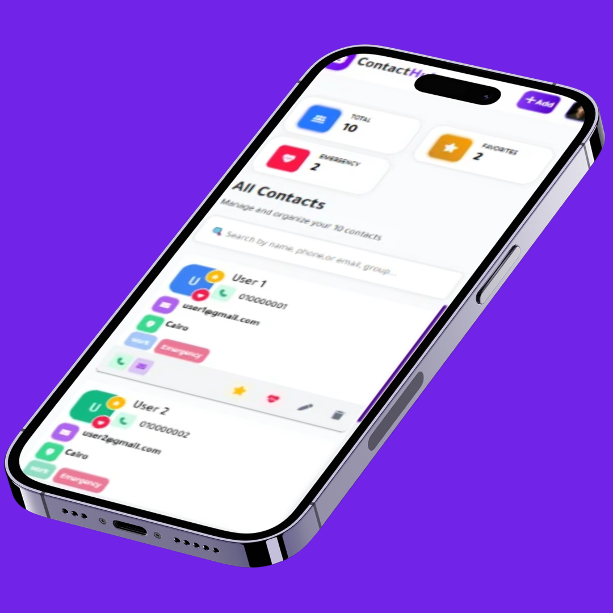

# 🧠 ContactHub: A Comprehensive Contact Management System
ContactHub is a feature-rich contact management system designed to help users efficiently manage their contacts. The application provides a user-friendly interface for adding, editing, and deleting contacts, as well as searching and filtering capabilities. With its robust feature set and intuitive design, ContactHub is an ideal solution for individuals and organizations seeking to streamline their contact management processes.

## 🚀 Features
- **Contact Management**: Add, edit, and delete contacts with ease
- **Search Functionality**: Quickly find specific contacts using the search bar
- **Favorite Contacts**: Mark important contacts as favorites for easy access
- **Emergency Contacts**: Designate emergency contacts for critical situations
- **Validation**: Input validation ensures data accuracy and consistency
- **Local Storage**: Contact data is stored locally for offline access

## 🛠️ Tech Stack
* Frontend: HTML, CSS, JavaScript
* Libraries: Bootstrap, Bootstrap Icons, Font Awesome, Swal
* Storage: Local Storage
* Dependencies: index.html, main.js, Ui.js, searchCode.js, updateCode.js, Favorites.js, emergency.js, validitiondata.js

## 📦 Installation
To get started with ContactHub, follow these steps:
1. Clone the repository to your local machine
2. Open the index.html file in a web browser to launch the application
3. No additional installation or setup is required

## 💻 Usage
1. Browse the project at the following link: https://sulimanragab.github.io/ContactHub/
2. Click the "Add Contact" button to create a new contact
3. Fill in the contact form with the required information
4. Click the "Save" button to save the new contact
5. Use the search bar to find specific contacts
6. Click on a contact to view their details

## 📂 Project Structure
```markdown
ContactHub/
│
├── index.html
├── main.js
├── Ui.js
├── searchCode.js
├── updateCode.js
├── Favorites.js
├── emergency.js
├── validitiondata.js
├── style.css
└── README.md
```

<h2>📸 Screenshots</h2>

<h3>Desktop View</h3>


<h3>iPad View</h3>


<h3>Mobile View</h3>


Contributions to ContactHub are welcome and appreciated. To contribute, please fork the repository and submit a pull request with your changes.

## 📝 License
ContactHub is licensed under the MIT License.

## 📬 Contact
For questions, feedback, or support, please contact us at [contact@example.com](mailto:contact@example.com).

## 💖 Thanks Message
Thank you for using ContactHub! We hope you find it helpful in managing your contacts. 
This is written by [readme.ai](https://readme-generator-phi.vercel.app/)
